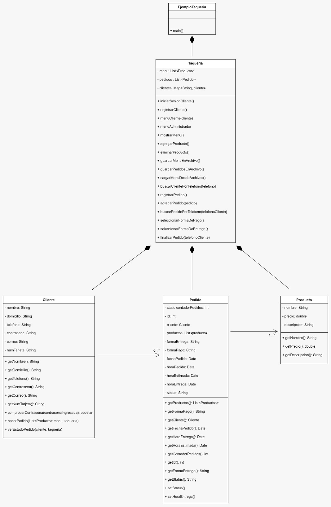

# Taquería DonTaco

**I. Introducción**

El problema se centra en una taquería que opera múltiples sucursales y acepta pedidos a través de varios canales, como teléfono, página web y aplicación móvil. Los pedidos pueden ser para recoger en la tienda o para entrega a domicilio, con una tarifa adicional si el pedido es de entrega a domicilio y el monto es inferior a $200. Los clientes deben registrarse proporcionando detalles como dirección, número de teléfono, correo electrónico y número de tarjeta bancaria para poder hacer pedidos.

Este informe detalla el proceso de desarrollo del Sistema de Gestión de Pedidos para una Taquería, cumpliendo con los requisitos y expectativas del cliente. El sistema ha sido meticulosamente diseñado para gestionar eficientemente los pedidos de clientes y facilitar el control administrativo del menú y las operaciones del negocio.

---

**II. Planificación**

**Definición de Requisitos:**
Durante la fase inicial del desarrollo, se llevaron a cabo reuniones para identificar y comprender sus requisitos clave. Los requisitos identificados incluyen:

• Implementar un sistema para gestionar pedidos de clientes.

•	Usuarios: clientes y administradores.

•	Funcionalidades clave: registro/inicio de sesión de clientes, gestión del menú, registro de pedidos, entrega de pedidos y consulta del estado de los pedidos.

El resultado de esas reuniones es un sistema que permitiera a los clientes realizar pedidos para recoger en la tienda o ser entregados a domicilio. Además, se establecieron dos roles de usuario: clientes y administradores. Los clientes debían tener la capacidad de realizar pedidos después de registrarse en el sistema, mientras que los administradores debían tener la capacidad de realizar pedidos y gestionar el menú y los pedidos existentes.

**Diseño de Clases:**
Para satisfacer estos requisitos, se diseñaron clases clave: `Cliente`, `Producto`, `Pedido` y `Taqueria`. Estas clases fueron estructuradas de manera precisa, estableciendo atributos y métodos esenciales para facilitar un flujo de trabajo coherente y eficiente.

---

**III. Implementación de Clases**

### Diagrama de clases

**Cliente:**

Se implementaron métodos robustos para el registro e inicio de sesión de clientes. Estos métodos no solo permiten a los clientes acceder al sistema, sino que también garantizan la seguridad de sus datos mediante la validación de contraseñas y un almacenamiento seguro de la información.

**Productos:**

La clase `Producto` fue desarrollada para contener detalles como nombre, precio y descripción. Esta estructura permitió una gestión ordenada y detallada del menú de la taquería.

**Pedidos:**

Se implementó lógica compleja para calcular el total del pedido, gestionar el estado del pedido (pendiente/entregado) y administrar la lista de productos asociados al pedido. Esta clase fue fundamental para asegurar la precisión y confiabilidad de los registros de pedidos.

**EjemploTaqueria**
Es una clase que sirve como principal ya que en ella se encuentra un método main, lo que hace esta clase es creae un objeto de tipo taquería, y ejecuta el método main de taquería que es donde se encuentra gran parte de la funcionalidad del programa.

**Taqueria:**

La clase `Taqueria` actuó como el núcleo del sistema, facilitando métodos para gestionar el menú, los pedidos y la información del cliente. La implementación de estructuras de datos `HashMap` permitió un acceso rápido y eficiente a los datos de productos y clientes, optimizando así las operaciones de búsqueda y eliminación.

---

**IV. Manejo de Datos**

El uso estratégico de `HashMaps` para almacenar clientes aseguró una recuperación de datos ágil y eficiente. Las claves únicas (números de teléfono para clientes) garantizaron un acceso rápido y preciso a la información requerida.

Se implementaron métodos para cargar y guardar datos desde/hacia archivos, proporcionando una persistencia de datos fiable. Esta práctica aseguró que la información del sistema permaneciera intacta incluso después de cerrar la aplicación.

Además, se implementaron mecanismos para gestionar excepciones y errores de manera eficiente, asegurando una experiencia de usuario sin interrupciones.

---

**V. Pruebas y Depuración**

Se llevaron a cabo pruebas de cada función y método para verificar su funcionalidad y precisión. Durante esta fase, se identificaron y corrigieron errores para garantizar un rendimiento óptimo del sistema en todas las condiciones.

---

**VI. Optimización y Mejoras**

Se realizaron análisis del rendimiento del sistema para identificar áreas de mejora. La optimización se llevó a cabo para mejorar la eficiencia del código y la velocidad de ejecución. Además, se consideraron y aplicaron mejoras en la interfaz de usuario para mejorar la usabilidad y satisfacer las expectativas de los usuarios finales.

---

**VII. Comentarios**

El enfoque metódico en el diseño y desarrollo del Sistema de Gestión de Pedidos ha resultado en un producto robusto y confiable. Para su implementación tomamos en cuenta lo siguiente: 
•	**Encapsulación y Seguridad:**
Utilizando la encapsulación, los datos sensibles del cliente, como el número de tarjeta bancaria, pueden ocultarse al mundo exterior, permitiendo un acceso controlado a través de métodos específicos (getters y setters). Esto garantiza la seguridad y privacidad de los datos del cliente.

•	**Flexibilidad y Mantenimiento:**
La POO permite organizar el código de manera modular. Cada entidad (clase) puede tener sus propios métodos y atributos, lo que facilita la modificación y mantenimiento del sistema sin afectar otras partes del código.

•	**Reutilización del Código:**
La POO permite reutilizar clases existentes para crear nuevas funcionalidades. Por ejemplo, si se necesita implementar una nueva forma de pago, se puede crear una nueva clase para manejarla sin afectar el resto del sistema.

•	**Claridad y Entendimiento:**
La POO mejora la claridad y el entendimiento del código, ya que las entidades y sus interacciones se modelan de manera similar a cómo ocurren en el mundo real. Esto facilita la comprensión del sistema para los desarrolladores y permite una mejor colaboración en equipo.

**VII. Conclusiones**

•	**Conclusión de Italia.**

En resumen, la elección de la programación orientada a objetos se revela como una decisión sólida y prudente para abordar el problema en cuestión. La capacidad inherente de este paradigma para modelar entidades y sus interacciones de forma clara y estructurada no solo proporciona una comprensión profunda del sistema, sino que también establece una base sólida para su desarrollo y evolución continua.

La estructura modular y flexible de la programación orientada a objetos es esencial en el contexto de la taquería. Esta característica no solo facilita el mantenimiento continuo del sistema, permitiendo la introducción de mejoras y correcciones de manera eficiente, sino que también allana el camino para futuras expansiones. En un entorno dinámico como el de un negocio de alimentos, donde las necesidades y expectativas de los clientes pueden cambiar rápidamente, la capacidad de adaptarse de manera ágil se convierte en un activo invaluable.

Además, la aplicación de principios como la encapsulación en el diseño del sistema garantiza la seguridad y privacidad de los datos del cliente. En un ámbito donde se manejan datos personales y financieros sensibles, este aspecto no puede ser subestimado. La confidencialidad y la integridad de la información son fundamentales para construir la confianza del cliente y cumplir con los estándares de seguridad requeridos en cualquier negocio.

En definitiva, la programación orientada a objetos no solo se presenta como una solución técnica eficaz, sino también como una elección ética y responsable, asegurando tanto la funcionalidad óptima del sistema como la protección integral de la privacidad del cliente. Esta metodología se erige como un pilar fundamental en el desarrollo de aplicaciones que no solo cumplen con las demandas tecnológicas del presente, sino que también están preparadas para enfrentar los desafíos del futuro de manera segura y adaptable.

•	**Conclusión de Marco.**

El proyecto implica la implementación de un sistema basado en el paradigma de la programación orientada a objetos, que aborda el problema de una taquería. Para ello, se implemento un programa que guarda los registros de los pedidos que se hacen además de que también se puede hacer un registro de los pedidos que se necesitan

Como me pude dar cuenta a lo largo del trimestre el paradigma de la programación orientada a objetos es un paradigma muy utilizado y que se puede relacionar con todo en esta vida, de hecho por eso es orientado a objetos, entonces resulta muy importante aprender este paradigma para poder sistemas no solo de este tipo sino de mayor complejidad por que en el campo laboral es el paradigma más utilizado.

•	**Conclusión de Isaí.**

En conclusión, hemos desarrollado una aplicación en un lenguaje de programación versátil y eficiente que permite interactuar con archivos de datos de manera efectiva. Este lenguaje es compatible con diversas bibliotecas, lo que facilita la manipulación de varios formatos de archivo.

El diseño modular de la aplicación no solo simplifica su mantenimiento y futura expansión, sino que también demuestra una gestión eficiente de los recursos. Los métodos específicos para guardar cambios y liberar los recursos utilizados son fundamentales para las operaciones de lectura y escritura en archivos. Además, la aplicación asegura la coherencia y precisión de los datos al reorganizar ciertos identificadores clave después de cualquier modificación en el archivo. Prestar atención a estos detalles es crucial cuando se maneja información importante en archivos.

En resumen, esta aplicación es un ejemplo destacado de cómo utilizar un lenguaje de programación eficiente para interactuar con archivos de datos de manera efectiva. Proporciona un sistema robusto y flexible para gestionar la información contenida en un archivo, garantizando la integridad y precisión de los datos.
